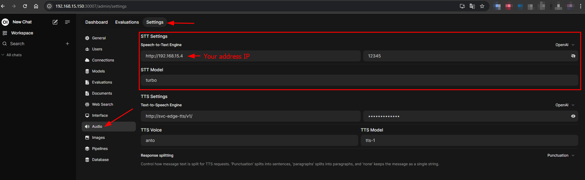

# Audio Transcriber Whisper API

This repository provides a bridge for connecting **Open-WebUI** to **Whisper**, enabling seamless audio transcription. It leverages a Python-based service to reformat requests from Open-WebUI into the format expected by Whisper. This integration allows Open-WebUI to communicate effectively with a locally hosted Whisper container, handling audio transcription requests and returning results in JSON format.

## Overview

When configuring STT (Speech-to-Text) with Open-WebUI, a gap was identified in the communication between Open-WebUI and a locally running Whisper service in Docker. To resolve this, the `audio-transcriber-whisper-api` service was developed to facilitate correct data handling and forwarding.

## How It Works

The service is built with Python and Flask, listening for audio files on a specified route. When Open-WebUI sends audio files for transcription, this service:

1. Receives the file and associated model parameter.
2. Logs request details for debugging.
3. Sends the audio file to Whisper with the appropriate field names.
4. Returns the transcription result in JSON format.

The service is containerized and published on Docker Hub as `didevlab/audio-transcriber-whisper-api:1.0.0`.

## Requirements

- Docker
- Docker Compose (for multi-container setup)
- NVIDIA GPU (optional, if using a GPU-enabled Whisper image)

## Usage

### Docker Image

The Docker image for this service is available on Docker Hub:

```bash
docker pull didevlab/audio-transcriber-whisper-api:1.0.0
```

### Docker Compose Setup

The following `docker-compose.yml` file configures the service with the necessary environment variables and dependencies to connect with the Whisper API.

```yaml
version: '3.8'

services:
  audio_transcriber:
    image: didevlab/audio-transcriber-whisper-api:1.0.0
    container_name: audio_transcriber_whisper_api
    restart: always
    environment:
      - PORT=80
      - API_WHISPER_URL=whisper_api  # Whisper service address (e.g., 'whisper_api' or IP)
      - API_WHISPER_PORT=9000
      - API_WHISPER_TIMEOUT=360000  # 6 minutes timeout for Whisper response
    ports:
      - "5000:80"
    depends_on:
      - whisper_api

  whisper_api:
    image: onerahmet/openai-whisper-asr-webservice:latest-gpu
    container_name: whisper_api
    restart: always
    environment:
      - ASR_MODEL=turbo
      - ASR_ENGINE=openai_whisper
      - NVIDIA_VISIBLE_DEVICES=all  # Uncomment if using GPU
    runtime: nvidia  # Required to enable GPU usage
    ports:
      - "9000:9000"
    volumes:
      - whisper_model:/root/.cache/whisper

volumes:
  whisper_model:
    driver: local
```

### Environment Variables

- **`PORT`**: Port on which this service listens (default: 80).
- **`API_WHISPER_URL`**: URL of the Whisper API service.
- **`API_WHISPER_PORT`**: Port used by the Whisper service.
- **`API_WHISPER_TIMEOUT`**: Timeout duration in milliseconds for Whisper responses.

### Flask API Route

The service exposes a route for transcriptions:

- **Endpoint**: `/audio/transcriptions`
- **Method**: `POST`
- **Parameters**:
  - `file` (required): Audio file to transcribe.
  - `model` (optional): Whisper model to use (default is `medium`).
- **Response**: JSON with transcription text or error message.

### Example Request

Using `curl`, you can send an audio file for transcription:

```bash
curl -X POST http://localhost:5000/audio/transcriptions      -F "file=@path/to/your_audio_file.wav"      -F "model=base"
```

## Open-WebUI STT Configuration

To configure the Open-WebUI to point to this STT service, refer to the following image:



## Logging and Debugging

This service logs incoming requests and responses to assist with debugging. Logs can be viewed in the container's standard output.

## Notes

- This setup requires Whisper to be accessible on the configured IP and port.
- If using a GPU-enabled version of Whisper, ensure NVIDIA drivers and Docker’s `nvidia-runtime` are configured.

---

### License

MIT License. See `LICENSE` file for details.
